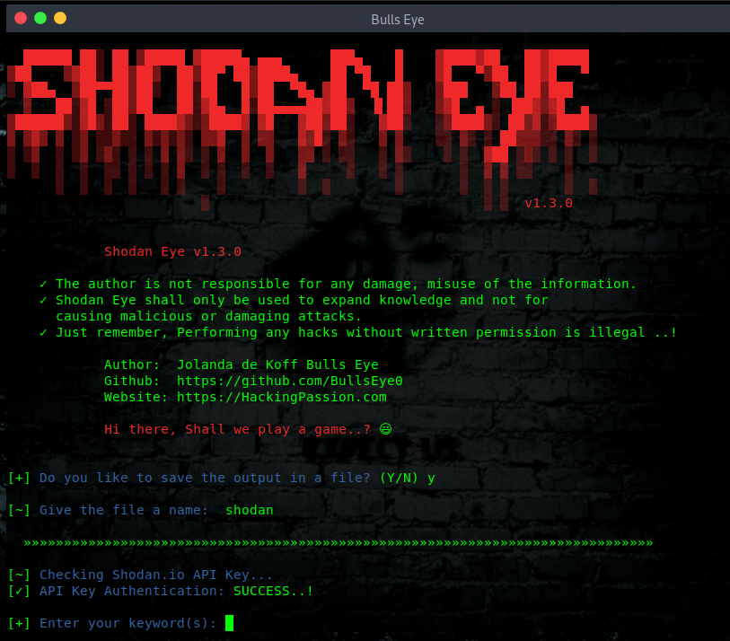
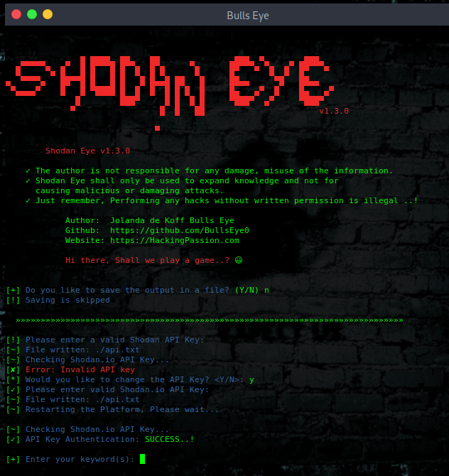
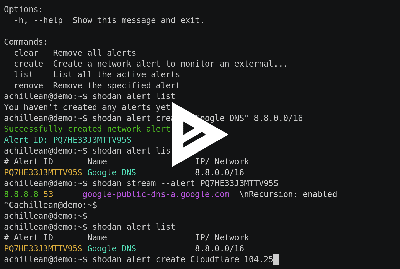

# Shodan Eye
This tool collects all information about all devices that are directly connected to the internet with the specified keywords that you enter. This way you get a complete overview.
****

Here you can read the latest article about Shodan Eye:

https://hackingpassion.com/shodan-eye-ethical-hacking-tool-release/
****
Article Install Shodan Eye on Termux can be found here:

https://hackingpassion.com/android-hacking-with-termux/#INSTALL_SHODAN_EYE
****

The types of devices that are indexed can vary enormously: from small desktops, refrigerators to nuclear power plants and everything in between. You can find everything using "your own" specified keywords. Examples can be found in a file that is attached:

The information obtained with this tool can be applied in many areas, a small example:
* Network security, keep an eye on all devices in your company or at home that are confronted with internet.
* Vulnerabilities.
And so much more.
****

# Shodan Eye Ethical Hacking Tool Release
Before we start the year 2020, today there is a new big release ..! 
Please note, if you have already installed Shodan Eye on your computer, then it is worthwhile to read it carefully. Of course, even if you don’t know this Shodan tool yet.

* Shodan Eye goes from python 2 to python 3
* Save the output of the Shodan Eye results
* The entry of the Shodan password is no longer visible.

# Shodan 
Is a search engine that lets the user find specific types of computers (webcams, routers, servers, etc.) connected to the internet using a variety of filters. Some have also described it as a search engine of service banners, which are metadata that the server sends back to the client.

***What is the difference between Google or another search engine:***
The most fundamental difference is that Shodan Eye crawls on the internet, Google on the World Wide Web. However, the devices that support the World Wide Web are only a small part of what is actually connected to the Internet.
****

## Shodan
For additional data gathering, you can enter a Shodan API key when prompted.
A Shodan API key can be found here: https://account.shodan.io/register
****

## A collection of search queries for Shodan is attached:
Shodan Dorks ... The Internet of Sh*t
* https://github.com/BullsEye0/shodan-eye/blob/master/Shodan_Dorks_The_Internet_of_Sh*t.txt
****

## I also want to make you aware that:
* This was written for educational purpose and pentest only.
* The author will not be responsible for any damage ..!
* The author of this tool is not responsible for any misuse of the information.
* You will not misuse the information to gain unauthorized access.
* This information shall only be used to expand knowledge and not for
causing malicious or damaging attacks.
* Performing any hacks without written permission is illegal ..!
****


****

****

****

## Video Shodan Eye on YouTube:
[Link to: Shodan Eye on YouTube](https://youtu.be/fOqmlOLiMsQ "Shodan Eye on YouTube")

****

# Getting Started
Grab your API key from https://account.shodan.io

.. code-block:: python

    from shodan import Shodan

    api = Shodan('MY API KEY')

    # Lookup an IP
    ipinfo = api.host('8.8.8.8')
    print(ipinfo)

    # Search for websites that have been "hacked"
    for banner in api.search_cursor('http.title:"hacked by"'):
        print(banner)

    # Get the total number of industrial control systems services on the Internet
    ics_services = api.count('tag:ics')
    print('Industrial Control Systems: {}'.format(ics_services['total']))


Installation
------------
To install the Shodan library, simply:

.. code-block:: bash

    $ pip install shodan

Or if you don't have pip installed (which you should seriously install):

.. code-block:: bash

    $ easy_install shodan

Documentation
-------------
Or if you already have it installed and want to upgrade to the latest version:

.. code-block:: bash
	
	$ easy_install -U shodan

It's always safe to update your library as backwards-compatibility is preserved.
Usually a new version of the library simply means there are new methods/ features
available.

To get started with the Python library for Shodan, first make sure that you've
`received your API key <https://account.shodan.io>`_. Once that's done,

Connect to the API
------------------
The first thing we need to do in our code is to initialize the API object:

.. code-block:: python

	import shodan
	
	SHODAN_API_KEY = "insert your API key here"
	
	api = shodan.Shodan(SHODAN_API_KEY)

	
Searching Shodan
----------------
Now that we have our API object all good to go, we're ready to perform a search:

.. code-block:: python
	
	# Wrap the request in a try/ except block to catch errors
	try:
		# Search Shodan
		results = api.search('apache')
		
		# Show the results
		print('Results found: {}'.format(results['total']))
		for result in results['matches']:
			print('IP: {}'.format(result['ip_str']))
			print(result['data'])
			print('')
	except shodan.APIError as e:
		print('Error: {}'.format(e))

Stepping through the code, we first call the :py:func:`Shodan.search` method on the `api` object which
returns a dictionary of result information. We then print how many results were found in total,
and finally loop through the returned matches and print their IP and banner. Each page of search results
contains up to 100 results.

There's a lot more information that gets returned by the function. See below for a shortened example
dictionary that :py:func:`Shodan.search` returns:

.. code-block:: python
	
	{
		'total': 8669969,
		'matches': [
			{
				'data': 'HTTP/1.0 200 OK\r\nDate: Mon, 08 Nov 2010 05:09:59 GMT\r\nSer...',
				'hostnames': ['pl4t1n.de'],
				'ip': 3579573318,
				'ip_str': '89.110.147.239',
				'os': 'FreeBSD 4.4',
				'port': 80,
				'timestamp': '2014-01-15T05:49:56.283713'
			},
			...
		]
	}

Please visit the `REST API documentation <https://developer.shodan.io/api>`_ for the complete list of properties that the methods can return.

It's also good practice to wrap all API requests in a try/ except clause, since any error
will raise an exception. But for simplicity's sake, I will leave that part out from now on.

Looking up a host
-----------------
To see what Shodan has available on a specific IP we can use the :py:func:`Shodan.host` function:

.. code-block:: python
	
	# Lookup the host
	host = api.host('217.140.75.46')
	
	# Print general info
	print("""
		IP: {}
		Organization: {}
		Operating System: {}
	""".format(host['ip_str'], host.get('org', 'n/a'), host.get('os', 'n/a')))
	
	# Print all banners
	for item in host['data']:
		print("""
			Port: {}
			Banner: {}
			
		""".format(item['port'], item['data']))

Documentation is available at https://shodan.readthedocs.org/ and https://help.shodan.io

# Install Shodan Eye on Linux:
****

Shodan Eye has tested it so far on:

**Linux**
Kali Linux
Parrot Security OS
BlackArch
Ubuntu
Arch-based
Debian-based

**Termux**
**Windows**

****

This list would be expanded

```
git clone https://github.com/BullsEye0/shodan-eye.git
```
cd shodan-eye
```
pip3 install -r requirements.txt
```

# How to use Shodan Eye

```
python3 shodan-eye.py
```

****
	
#### Shodan API Documention :
  
* [REST API Documentation](https://developer.shodan.io/api)
  
* [Exploits REST API Documentation](https://developer.shodan.io/api/exploits/rest)

##### Shodan API Specification :

* [Banner Specification](https://developer.shodan.io/api/banner-specification)

<i> The banner is the main type of information that Shodan provides through the REST and Streaming API. This document outlines the various properties that are always present and which ones are optional. </i>

* [Exploit Specification](https://developer.shodan.io/api/exploit-specification)

<i> The exploit type contains the normalized data from a variety of vulnerability data sources. The Exploits REST API returns this type for its search results. This document outlines the various properties that are always present and which ones are optional. </i>

Have fun ..! 😃
****

# Contact to coder
Social Networks - Connect

* Website [HackingPassion.com](https://hackingpassion.com)

* Website [BullsEye0.com](https://bullseye0.com)

* [Facebook Personal](https://www.facebook.com/jolandadekoff)

* [linkedin](https://www.linkedin.com/in/jolandadekoff/)

* [Youtube](https://youtu.be/XCtWM-4ov2U)

* [Facebook Page](https://www.facebook.com/ethical.hack.group)

* [Facebook Group](https://www.facebook.com/groups/ethical.hack.group/)

***

## Donate
I have developed Shodan Eye because I am passionate about this. 
Donations are one of the many ways to support what I do.
[Donate](https://bullseye0.com/donate)

BAT: Use [Brave](https://brave.com/bul891) and donate on any of my web pages/profiles

[](https://www.paypal.com/cgi-bin/webscr?cmd=_s-xclick&hosted_button_id=R96YN2PUS8V8W)

shodan: The official Python library and CLI for Shodan
======================================================
[](https://pypi.org/project/shodan/) [](https://github.com/achillean/shodan-python/graphs/contributors)

Shodan is a search engine for Internet-connected devices. Google lets you search for websites,
Shodan lets you search for devices. This library provides developers easy access to all of the
data stored in Shodan in order to automate tasks and integrate into existing tools.

Features
--------

- Search Shodan
- `Fast/ bulk IP lookups <https://help.shodan.io/developer-fundamentals/looking-up-ip-info>`_
- Streaming API support for real-time consumption of Shodan firehose
- `Network alerts (aka private firehose) <https://help.shodan.io/guides/how-to-monitor-network>`_
- `Manage Email Notifications <https://asciinema.org/a/7WvyDtNxn0YeNU70ozsxvXDmL>`_
- Exploit search API fully implemented
- Bulk data downloads
- Access the Shodan DNS DB to view domain information
- `Command-line interface <https://cli.shodan.io>`_


